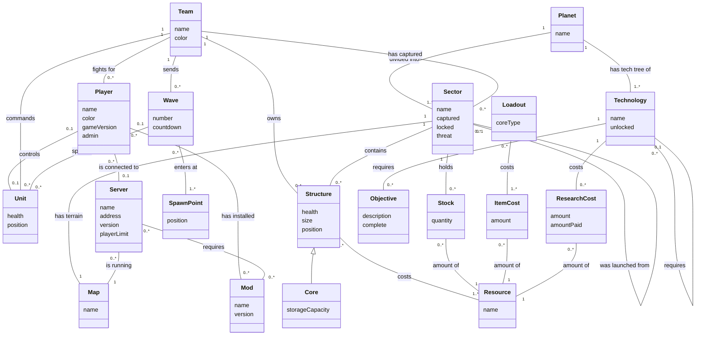

# Mindustry Domain Model

Conceptual model of the *game world* Mindustry simulates (not the code).
Attributes only: no methods, types, or visibility markers.

Updated for A2b (SSDs and Operation Contracts): added the campaign and multiplayer
concepts named in the three fully-dressed use cases (Launch to Sector, Research
Technology, Join Multiplayer Game).

## Notes

- **Stock moved from Core to Sector.** In the campaign, items belong to a sector
  (the Research use case totals items "across all captured sectors"). While a sector
  is being played they are physically in its Core, but conceptually the Sector holds them.
- **ItemCost vs ResearchCost.** A Loadout's cost is paid all at once. A Technology's
  cost can be paid in installments, so each ResearchCost also records `amountPaid`.
- **Player** means the in-game player: the one fighting for a Team and, in multiplayer, the
  one connected to a Server. The person at the keyboard is the *actor* Player in the SSDs.
