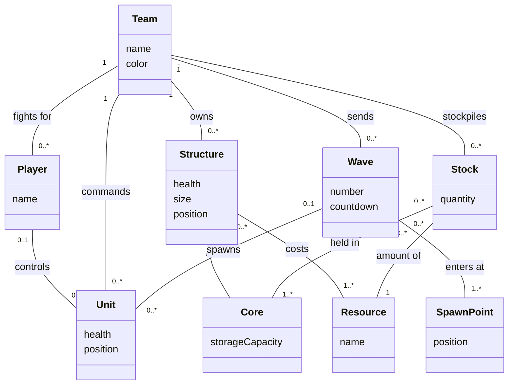

# Mindustry Initial Domain Model

Conceptual model of the *game world* Mindustry simulates (not the code).
Attributes only: no methods, types, or visibility markers.

```mermaid
classDiagram
    class Team {
        name
        color
    }
    class Player {
        name
    }
    class Unit {
        health
        position
    }
    class Structure {
        health
        size
        position
    }
    class Core {
        storageCapacity
    }
    class Resource {
        name
    }
    class Stock {
        quantity
    }
    class Wave {
        number
        countdown
    }
    class SpawnPoint {
        position
    }

    Structure <|-- Core

    Team "1" -- "0..*" Player : fights for
    Player "0..1" -- "0..1" Unit : controls
    Team "1" -- "0..*" Unit : commands
    Team "1" -- "0..*" Structure : owns
    Structure "0..*" -- "1..*" Resource : costs
    Team "1" -- "0..*" Stock : stockpiles
    Stock "0..*" -- "1" Resource : amount of
    Stock "0..*" -- "1..*" Core : held in
    Team "1" -- "0..*" Wave : sends
    Wave "0..1" -- "0..*" Unit : spawns
    Wave "0..*" -- "1..*" SpawnPoint : enters at
```
